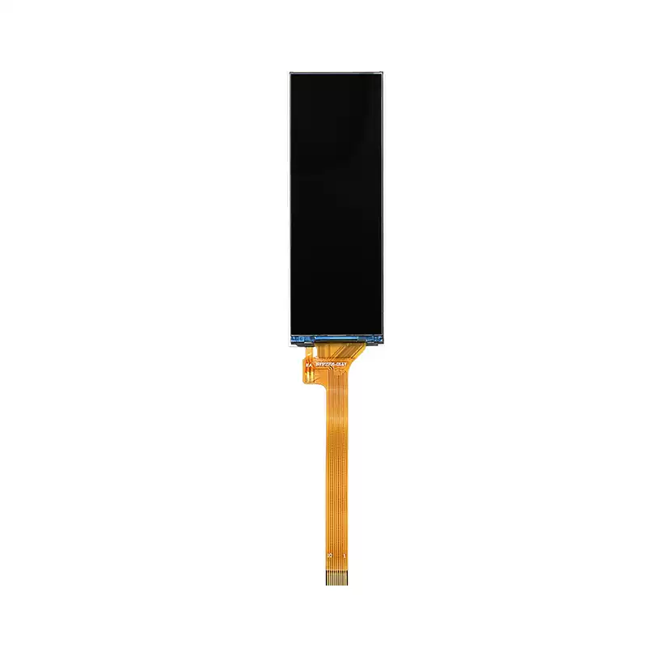

<p align="left"></p>

<h1 align="center">OSPTEK 2.79″ TFT 142×428 (NV3007A · SPI)</h1>

<p align="center"><b>Tall TFT module · 4-wire SPI · NV3007A</b></p>

<p align="center"><a href="./README.md">简体中文</a> | English · <a href="../../README_EN.md">Family index</a></p>

<p align="center">
  
  
  
  
</p>

<p align="center"></p>

## Contents

- [Overview](#overview)
- [Specifications](#specifications)
- [Repository layout](#repository-layout)
- [Resources](#resources)
- [Buy](#buy)
- [Support](#support)

## Overview

OSPTEK **2.79″ 142×428 TFT** is a **4-wire SPI** color display module driven by **NV3007A**. Its tall aspect ratio suits status strips, side information panels, and compact HMIs.

Spec ID (repository name): `tft-2.79-142x428-spi-nv3007`

Current module version: **YDP279B001-V2**. Electrical and mechanical details follow [`docs/YDP279B001-V2.pdf`](./docs/YDP279B001-V2.pdf).

## Specifications

| Item | Spec |
| ---- | ---- |
| Size | 2.79 inch |
| Type | Transmissive TFT |
| Resolution | 142×428 |
| Interface | 4-wire SPI |
| Driver IC | NV3007A |
| FPC | 10 pin |
| Touch | None |
| Module size | 24.38 × 69.43 × 2.15 mm |
| Active area | 21.28 × 64.14 mm |
| Operating temperature | -20 to 85 °C |

> Full outline, FPC definition, power, and timing follow the product datasheet.

## Repository layout

```text
tft-2.79-142x428-spi-nv3007/
└── versions/
    └── YDP279B001-V2/
        ├── README.md
        ├── README_EN.md
        ├── images/
        └── docs/
```

## Resources

| Resource | Link |
| ---- | ---- |
| Product datasheet (YDP279B001-V2) | [`docs/YDP279B001-V2.pdf`](./docs/YDP279B001-V2.pdf) |

## Buy

- AliExpress: [OSPTEK Official Store](https://www.aliexpress.com/store/1105701619)
- Taobao: [鱼鹰光电工厂店](https://shop110742373.taobao.com/)

## Support

- Technical support / product inquiry: <luyu@osptek.com>
- QQ group (China): **985881096**
- Website: <https://osptek.com/>
- Feel free to open an Issue in this repository if you have any questions

---

<p align="center"><sub>© 2026 OSPTEK · Materials in this repository are licensed under CC BY 4.0</sub></p>
